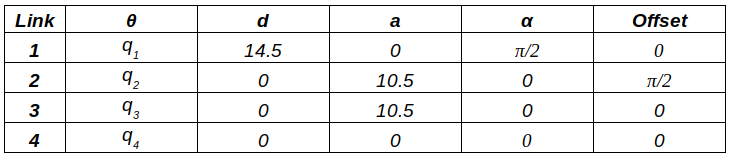
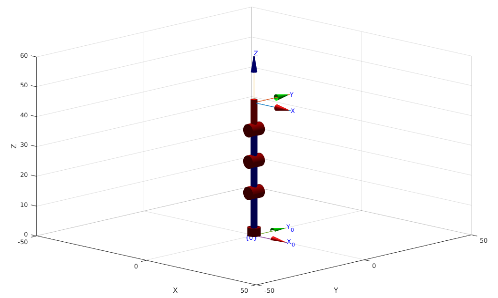
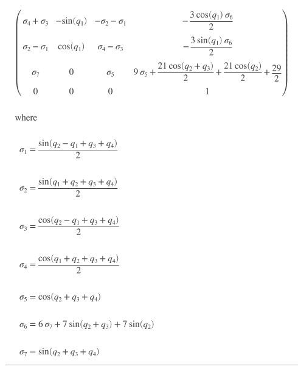
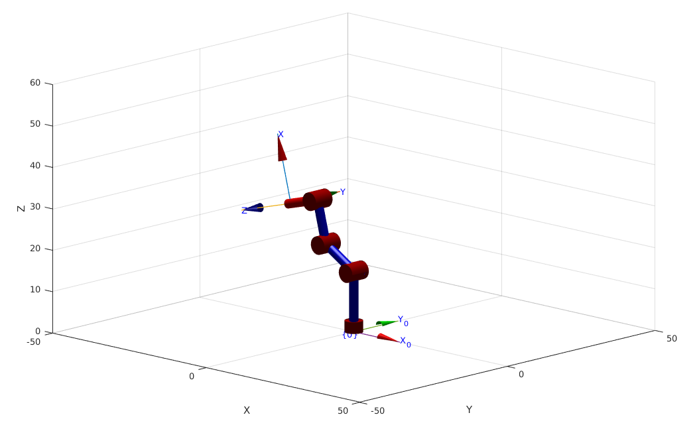
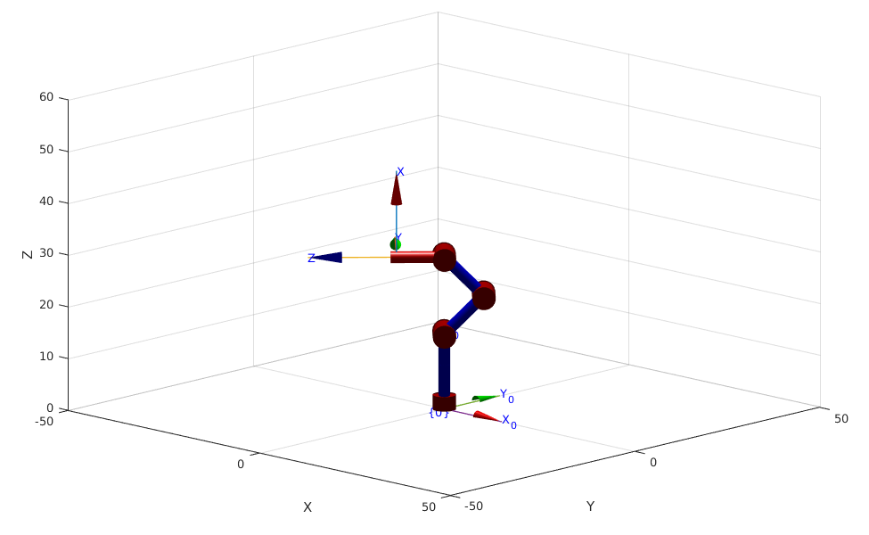
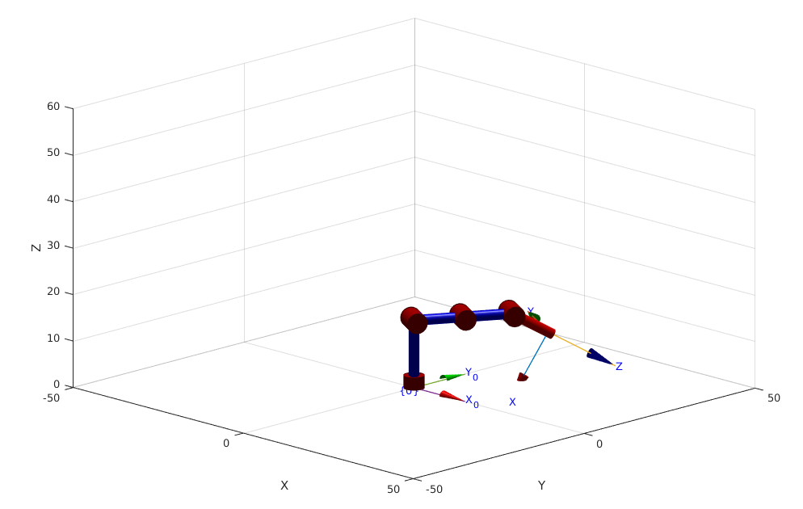

# Laboratorio 2 - Robótica: Cinemática Directa - Phantom X - ROS
El siguiente repositorio muestra el trabajo realizado para el Laboratorio 2 de la materia Robótica donde se busca entender la cinemática directa de manipuladores utilizando el robot "Phantom X Pincher", interactuando con este a través de MATLAB y ROS usando scripts de Python para cambiar la posición del robot.

## Autor
* Nicolas Pulido Gerena

## Mediciones

Con ayuda de un calibrador se establecen las mediciones de eslabon para cada articulación:
* Eslabón 1: 14.5 cm
* Eslabón 2: 10.5 cm
* Eslabón 3: 10.5 cm
* Eslabón 4: 9 cm

Los cuales se pueden apreciar en la siguiente figura.

## Análisis DH
A partir de esto se obtienen los parametros DH correspondientes

<p align="center">
  
</p>

## ROS
Se realizó un script en Python bajo el nombre de "[px_Teleopkey](https://github.com/npulidog/lab_2_robotica-2022I/blob/002867e4908d164e5845d1493e0cc6b904ace3ce/px_robot/scripts/px_Teleopkey.py "px_Teleopkey")" que permite el movimiento entre posición objetivo y posición de home utilizando las teclas "D" y "A", permitiendo el movimiento independiente de articulaciones con el uso de las teclas "W" y "S".

## Toolbox

Se utiliza el comando SerialLink para crear el robot con los parámetros DH obtenidos anteriormente.
```Matlab
L(1) = Link('revolute','alpha',pi/2,'a',0,   'd',14.5,'offset',0,   'qlim',[-3*pi/4 3*pi/4]);
L(2) = Link('revolute','alpha',0,   'a',10.5,'d',0,   'offset',pi/2,'qlim',[-3*pi/4 3*pi/4]);
L(3) = Link('revolute','alpha',0,   'a',10.5,'d',0,   'offset',0,   'qlim',[-3*pi/4 3*pi/4]);
L(4) = Link('revolute','alpha',0,   'a',0,   'd',0,   'offset',0,   'qlim',[-3*pi/4 3*pi/4]);
Robot = SerialLink(L,'name','px');
```
Luego de esto se usa la convención NOA (Normal, Open, Approach) para representar el marco de la herramienta, utilizando el comando "tool" de SerialLink.

```Matlab
Robot.tool = [0 0 1 9; -1 0 0 0; 0 -1 0 0; 0 0 0 1];
```
Para verificar, se realiza una representación grafica del robot en su posición de Home con el marco de la herramienta siguiendo la convención NOA.

<p align="center">
  
</p>

Se realiza el calculo de la MTH (Matriz de Transformación Homogenea) multiplicando cada una de las matrices de transformación de los marcos desde la base hasta la herramienta.

```Matlab
syms q1 q2 q3 q4 as real

T1_0 = L(1).A(q1);
T1_0(1,2) = 0;
T1_0(2,2) = 0;
T1_0(3,3) = 0;
T2_1 = L(2).A(q2)
T3_2 = L(3).A(q3) 
T4_3 = L(4).A(q4)

MTH = simplify(T1_0*T2_1*T3_2*T4_3*Robot.tool)
```
Se obtiene la MTH, de la siguiente forma.

<p align="center">
  
</p>

Los valores correspondientes a q1, q2, q3, q4 son las variables correspondientes a los valores de cada articulación. En posición de Home todos ellos toman el valor de 0.

A continuación, se presentan 3 diferentes posiciones del robot diferentes a la posición de Home.

POSICIÓN 1:

```Matlab
% Posición 1
p1 = deg2rad([0 60 -45 90]);
Robot.plot(p1, 'notiles', 'noname');
```
<p align="center">
  
</p>

POSICIÓN 2:


```Matlab
% Posición 2
p2 = deg2rad([45 -45 90 45]);
Robot.plot(p2, 'notiles', 'noname');
```
<p align="center">
  
</p>

POSICIÓN 3:

```Matlab
% Posición 3
p3 = deg2rad([60 -90 0 -30]);
Robot.plot(p3, 'notiles', 'noname');
```
<p align="center">
  
</p>


## Conexión con Matlab

Para realizar la conexión entre Matlab y ROS se realiza la suscripción al topico "/dynamixel_workbench/joint_states" con el fin de obtener el valor correspondiente a cada articulación.

```Matlab
jointSub = rossubscriber('/dynamixel_workbench/joint_states', 'DataFormat','struct');
[msgSub,status,statustext] = receive(jointSub,10); 

disp("Angle in radians for each joint:")
disp(" ")

for i = 1:5
    disp("Joint" + i + ": " + msgSub.Position(i))
end
```

## Matlab + ROS + Toolbox

Ahora se utiliza el servicio "dynamixel_command" con el fin de enviar información y poder realizar el movimiento del robot fisico. Para ello se tuvieron en cuenta los valroes que el mismo servicio solicita en consola, como lo son "Addr.Name" que para este caso se utilizan Goal_Position o Torque_Limit dependiendo de lo que se quiera manipular, tambien valores como "Id" para seleccionar la articulación y el valor a aplicar en si. 

Se creó una función que permitiera recibir los valores de las articulaciones y modificarlos al mismo tiempo para todas las articulaciones y de esa forma asignar las configuraciones "q" de una vez y no articulación por articulación.

```Matlab
%% Función para mover las juntas y el gripper
function output = moveRobot(q)
    offsetID = 0;
    motorSvcClient = rossvcclient('/dynamixel_workbench/dynamixel_command');
    motorCommandMsg = rosmessage(motorSvcClient);

    motorCommandMsg.AddrName = "Torque_Limit";
    torque = [600, 400, 400, 400, 400];
    for i= 1: length(q) 
        motorCommandMsg.Id = i+offsetID;
        motorCommandMsg.Value = torque(i);
        call(motorSvcClient,motorCommandMsg);
    end
   
    motorCommandMsg.AddrName = "Goal_Position";
    for i= 1: length(q)
        disp(i)
        motorCommandMsg.Id = i+offsetID;
        disp(round(mapfun(rad2deg(q(i)),-150,150,0,1023)))
        motorCommandMsg.Value = round(mapfun(rad2deg(q(i)),-150,150,0,1023));
        call(motorSvcClient,motorCommandMsg); 
        pause(1);
    end
    
end
```
Por ultimo se hizo la prueba con las configuraciones presentadas a continuación:

```Matlab
% Valores de configuración
q1 = [deg2rad([90 0 0 0 0])];
q2 = [deg2rad([-20 20 -20 20 0])];
q3 = [deg2rad([30 -30 30 -30 0])];
q4 = [deg2rad([-90 15 -55 17 0])];
q5 = [deg2rad([-90 45 -55 45 10)]];
```

## Video en Youtube
[Robótica: Cinemática Directa - Phantom X - ROS](https://youtu.be/GdL3EysdHBM "Robótica: Cinemática Directa - Phantom X - ROSy")
